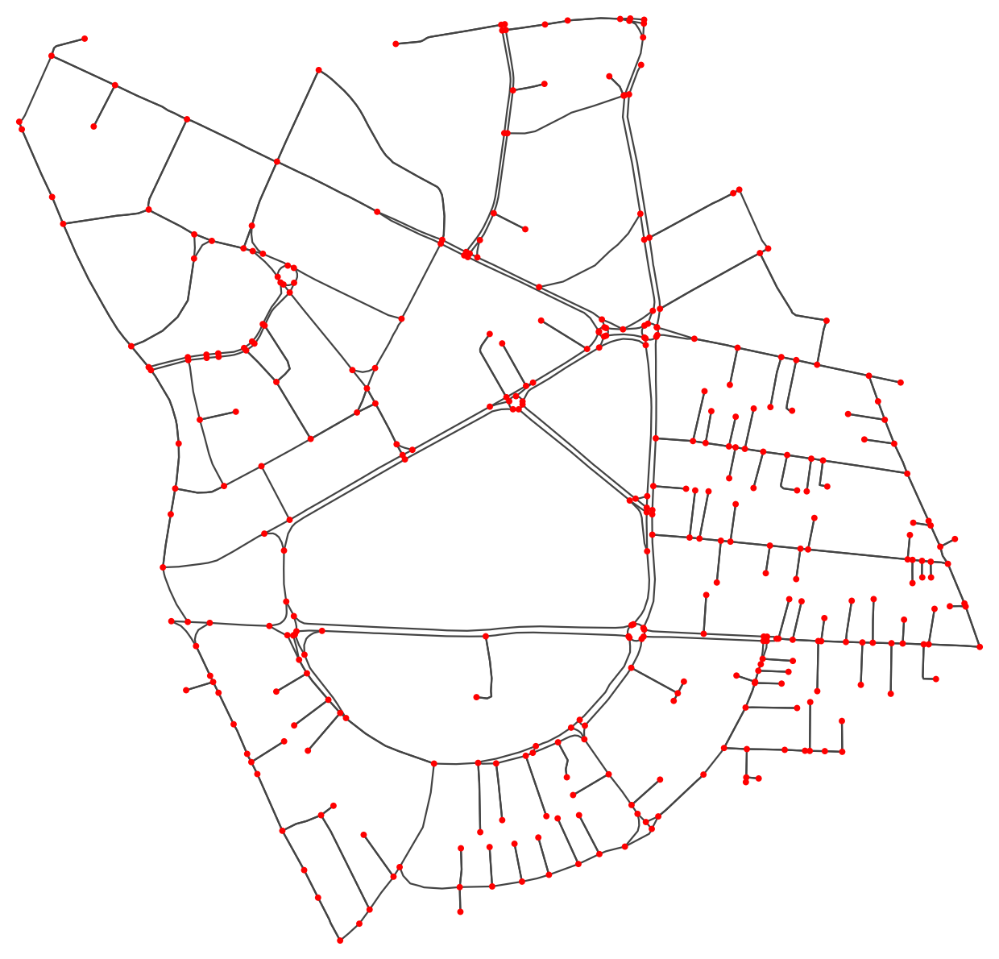

# Colombo Routing Engine

A C# console application that finds the shortest and fastest routes around **Colombo 2 and Colombo 7, Sri Lanka**,
using real road data from OpenStreetMap. It handles one-way streets, road closures, vehicle restrictions and
simulated rush-hour traffic, and compares classic graph algorithms for speed.

Built for **COMP50065 – Data Structures and Algorithms** (Scenario 01: Intelligent Urban Routing).



## At a glance

| | |
|---|---|
| Nodes (junctions) | **363** |
| Edges (directed road segments) | **675** |
| One-way segments | 233 |
| Two-way roads | 221 (stored as 442 edges, one per direction) |
| Total roads (two-way counted once) | **454** |
| Named locations (streets) | **62** |
| Algorithms | **7** – Dijkstra, A\*, Floyd–Warshall, BFS, DFS, brute-force critical search, Merge sort |
| Data structures | **9** – adjacency list, list, array, 2D array, priority queue, hash table, hash set, stack, queue |

## Features

- **Find a route by name** – type any part of a street name; capital letters and punctuation don't matter
- **Location list** – all 62 streets in A–Z order; pick one by name or number
- **Fastest or shortest** – optimise for travel time or distance
- **Rush hour** – pick any two places and compare the route with no traffic, the same route at rush hour, and the best rush-hour route
- **Constraints** – closed junctions (e.g. Alexandra Roundabout) and banned road types (e.g. heavy vehicles)
- **Reachability** – pick a start and a time budget; lists every location you can reach, with time and number of roads
- **Connectivity** – BFS vs DFS, plus one-way reachability to and from a point
- **Critical junctions and roads** – lists every junction and road whose closure cuts places off, and explains the worst one
- **Sparse vs dense** – adjacency list vs matrix, measured memory and speed
- **Edge cases** – invalid ids, same start and end, unreachable places, impossible constraints, empty network

## Algorithms and data structures

| Problem | Solution | Complexity | Compared against |
|---|---|---|---|
| Store the network | Adjacency list | O(V + E) space | Adjacency matrix (V², over 99% empty) |
| One route | Dijkstra with a heap priority queue | O((V + E) log V) | A\*, Floyd–Warshall |
| One route, faster | A\* (straight-line estimate) | Same worst case, fewer nodes explored | Dijkstra |
| Every route at once | Floyd–Warshall (dynamic programming) | O(V³) time, O(V²) space | Repeated Dijkstra |
| Reachability within a budget | Dijkstra with a cut-off | O((V + E) log V) | BFS (counts roads, not minutes) |
| Is the network connected? | BFS (queue) | O(V + E) | DFS (stack) |
| Critical junctions and roads | Brute force: close each one, measure the largest piece left | O(V × (V + E)) | Tarjan's algorithm (O(V + E), beyond module scope) |
| Closures and restrictions | Hash sets | O(1) per check | Deleting edges before each query |
| Name → location | Hash table (case-insensitive) | O(1) | Linear scan |
| Partial name search | Linear scan | O(L) | Trie (overkill for 62 names) |
| A–Z location list | Merge sort | O(n log n), stable | Quick sort |
| Rebuild the route | Stack | O(path length) | Recursion |

**Why brute force for critical junctions and roads?** A deliberate choice: it is simple and runs in milliseconds
on 363 junctions. On a much bigger map, Tarjan's algorithm (one DFS, O(V + E)) would replace it.

**Travel time** = length ÷ speed × congestion factor. Speed comes from the OSM speed limit where tagged,
otherwise the most common tagged speed for that road type in this data. Rush-hour factors are simulated
assumptions, not live traffic.

## Getting started

Requires the [.NET SDK](https://dotnet.microsoft.com/download) (built on .NET 10, macOS).

```bash
git clone https://github.com/damrunp/colombo-routing-engine.git
cd colombo-routing-engine/RoutingEngine
dotnet run
```

## Project structure

```
RoutingEngine/
├── Program.cs      Menu and demos
├── Graph.cs        Adjacency list, CSV loading, speeds, rush hour
├── Models.cs       Node, Edge, RouteConstraints, PathResult
├── PathFinder.cs   Dijkstra, A*, Floyd–Warshall
├── Locations.cs    Street names, search, merge sort
├── Analysis.cs     Reachability, BFS, DFS, bottlenecks
├── Benchmark.cs    Synthetic test maps, sparse vs dense test
└── Data/
    ├── nodes.csv   id, osm_id, lat, lon
    └── edges.csv   from, to, length_m, road_type, maxspeed, oneway, bridge, name
```

## How the real map was obtained

The road network comes from **OpenStreetMap**, downloaded in September 2026 with **OSMnx** (a Python library), in these steps:

1. **Drew the study area.** A polygon covering Colombo 2 and Colombo 7 was drawn at [geojson.io](https://geojson.io) and saved as `area.geojson`.
2. **Downloaded the drivable roads.** OSMnx (`graph_from_polygon`, `network_type="drive"`) downloaded every road a car can use inside the polygon.
3. **Simplified the network.** Only real junctions and dead ends were kept as nodes, not every bend in a road, and only the largest connected piece of the network was kept.
4. **Cleaned the data.** Self-loops were removed, and where two parallel roads joined the same two junctions, only the shorter one was kept.
5. **Renumbered the junctions** 0, 1, 2 ... so the C# code can use them directly as array indexes.
6. **Exported two CSV files:** `nodes.csv` (one row per junction, with GPS position) and `edges.csv` (one row per directed road segment, with length, road type, speed limit, one-way flag and street name).

7. **Filled in missing speed limits.** 111 of the 675 road segments had no speed limit in OpenStreetMap. When the C# engine loads the data (`Graph.cs`), each of these gets the most common tagged speed for its road type in this same dataset:

| Road type | Default speed |
|---|---|
| trunk, primary, primary_link | 60 km/h |
| secondary, secondary_link | 50 km/h |
| tertiary, tertiary_link | 40 km/h |
| residential, living_street, unclassified, other | 30 km/h |

The Python download script (`download_colombo.py`) was used only once to create the dataset, so it is not part of this C# project. The engine only reads the two CSV files.

## Data

The real network is in `RoutingEngine/Data`. Synthetic networks for the sparse vs dense test are generated in code (`Benchmark.Grid` and `Benchmark.Dense`) with a fixed random seed, so every run is repeatable.


Area: Colombo 7 and southern Colombo 2 (Union Place, Hunupitiya, Gangaramaya).
Map data © [OpenStreetMap contributors](https://www.openstreetmap.org/copyright), available under the ODbL.
